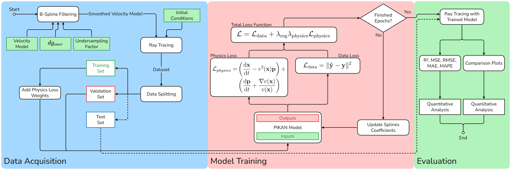

# PIKAN-RT: A Physics-Informed Kolmogorov-Arnold Network for Seismic Ray Tracing




## Overview

This repository contains the implementation of the **Physics-Informed Kolmogorov-Arnold Network for seismic Ray Tracing (PIKAN-RT)**, a novel framework for **efficiently modeling seismic ray tracing in complex geological environments**. PIKAN combines the compositional structure and interpretability of Kolmogorov-Arnold Networks (KANs) with the power of Physics-Informed Neural Networks (PINNs), ensuring high scalability, accuracy, and generalization in heterogeneous media.

### Key Features:

* **Synthetic Seismic Datasets:** Generated using B-spline smoothing and numerical ray tracing for training and evaluation.

* **Composite Loss Function:** Balances data fidelity and physical consistency, with adaptive weighting strategies for varying data density.

* **High Predictive Accuracy:** Achieves $R^2 > 0.98$ for all outputs and fast inference (323 rays traced in 399ms).

* **Robust Generalization:** Effectively generalizes to different initial conditions while preserving essential geological features.

PIKAN provides a scalable and real-time solution for geophysical modeling, addressing challenges in seismic imaging, reservoir characterization, and risk reduction in energy exploration. This framework is particularly beneficial for environments where traditional methods struggle with stability and efficiency.


## 💻 Requirements

Before you begin, ensure that you have met the following requirements:

- You have installed the latest version of [Anaconda](https://www.anaconda.com/docs/getting-started/getting-started)
- You are using a `<Windows/Linux/Mac>` machine. 
  - On **Windows**, ensure you have **WSL (Windows Subsystem for Linux)** installed to run Linux-based commands. You can check if WSL is installed by running:

    ```bash
    wsl --list --verbose
    ```

    If WSL is not installed, follow the instructions on the [WSL installation guide](https://docs.microsoft.com/en-us/windows/wsl/install).


## 🚀 Installing PIKAN-RT

To install PIKAN-RT, follow these steps:

1. **Navigate to the project directory**.
2. Run the following command to create the environment:

   ```bash
   conda env create -f conda.yaml
   ```
   
This will set up the `exai` environment with all the dependencies required to run the project.

## ☕ Reproducing Experiments with PIKAN-RT

To use PIKAN-RT, you need to choose which experiment you would like to reproduce:  
- Impact of Smoothing Factor  
- Impact of Grid Size  
- Evaluation of the Final Model  

Once the experiment is selected, you can run the entire Jupyter notebook using VSCode (with the proper extension), Jupyter Notebook, or Jupyter Lab. Please ensure that you have the necessary environment set up to execute Jupyter notebooks.

Remember that you may need to adjust the paths in the notebook to match your local directory structure.

Additionally, the Marmousi velocity model is available for download at [The Marmousi Experience](https://www.geoazur.fr/WIND/bin/view/Main/Data/Marmousi).


## 📝 License

This project is licensed. See the [LICENSE](LICENSE.md) file for more details.
